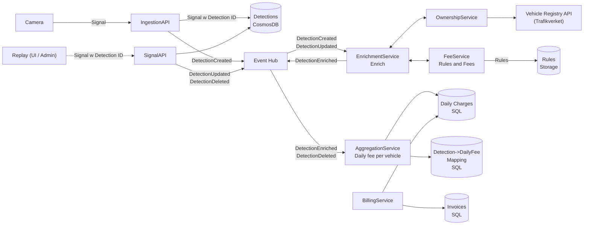

# Urban Toll Stream

# System Overview

The system ingests vehicle passage signals from cameras, processes them into validated detections, calculates toll fees, aggregates charges per vehicle and day, and periodically generates invoices.

---

# How the System Works

## 1. Ingestion

Cameras send **signals** (license plate, timestamp, image, confidence) to the Ingestion API.

- A stable `detectionId` is generated (e.g. based on camera + image hash)
- The detection is stored in the Detection Store (idempotent upsert)
- A `DetectionCreated` event is published

Updates or corrections are handled via the Signal API, producing:
- `DetectionUpdated`
- `DetectionDeleted`

DetectionAlerts:
- detectionId
- cameraId
- timestamp
- licensePlate/vehicleId
- confidence
- imageUrl
---

## 2. Enrichment

The Enrichment Service subscribes to detection events and:

- Calls the Ownership Service to determine **who owned the vehicle at the time**
- Enriches the detection with `ownerId`
- Enriches the detection with Fee (fee, rulesApplied and ruleVersion)

The enriched detection event is then emitted for downstream processing.

---

## 3. Fee Calculation

The Fee Service calculates the toll for a single passage based on:
- timestamp
- zone / pricing rules

---

## 4. Aggregation

The Aggregation Service builds **daily charges per vehicle**.

- Subscribes to:
  - `DetectionEnriched`
  - `DetectionDeleted`
- Maintains state per `(vehicleId, date)`
- Applies business rules:
  - 60-minute rule
  - daily cap

It also:
- Tracks which detections belong to each aggregation bucket using a mapping store  
  (`detectionId → vehicleId + date`)
- Handles updates and deletes by removing and recomputing affected aggregates

---

## 5. Billing

The Billing Service runs periodically and:

- Reads aggregated daily charges from the aggregation database
- Groups data by `(vehicleId, ownerId, billing period)`
- Generates invoices (including daily line items)
- Stores invoices in the Billing database

---

## 6. Ownership Resolution

Ownership is handled by a dedicated Ownership Service:

- Resolves **owner at a specific point in time**
- Calls an external vehicle registry API
- Uses caching and retry internally
- Encapsulates all external integration logic

---

## 7. Reprocessing

If external data changes (e.g. ownership corrections, camera time corrections):

- A replay process identifies affected detections (vehicle + time range)
- Detections are resubmitted via the Signal API
- The same pipeline is reused:
  - Detection → Enrichment → Fee → Aggregation

This ensures the system converges to the correct state without special-case logic.

---

# Key Design Principles

- Event-driven architecture
- Clear separation of concerns
- Stateless services (enrichment, fee calculation)
- Stateful aggregation as a projection
- Reprocessing instead of complex joins
- External dependencies isolated behind dedicated services

---

# Out of Scope

Intentionally skipped, but is required for a real, production-worthy, system:
- Security: authentication, authorization, data protection, zero trust
- Infrastructure: deployment, scaling, monitoring. This is a pure Aspire project
- Testing: unit, integration, end-to-end testing strategies
- UI/UX: user interfaces for admin or customer portals
- Error handling and retries: detailed strategies for handling failures, retries, and compensating actions
- Data retention and GDPR compliance: strategies for data lifecycle management, anonymization, and user data
- Performance optimization: caching strategies, database indexing, and other optimizations for high throughput and low latency
